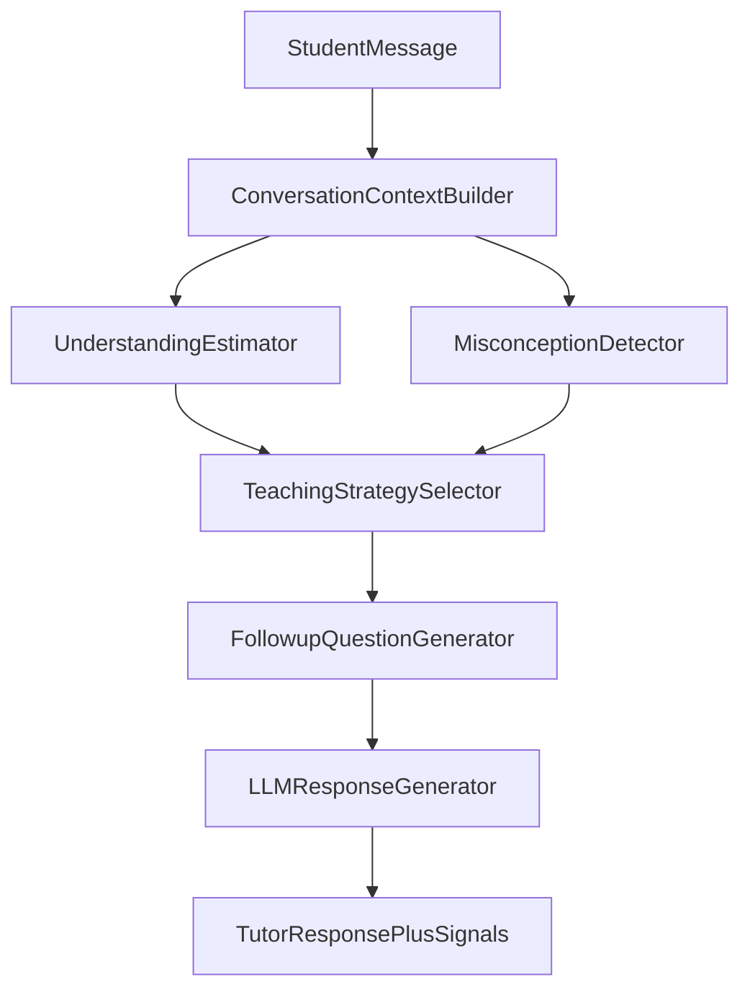

# Pipeline triển khai — AI Tutor Learning Engine

> Bản đồ triển khai duy nhất trước khi code / viết `spec.md`.  
> Hướng: **A — VLearn** · Loại: **Tối ưu AI Tutor hiện có**  
> Nguồn: brief nhóm + `01-de-bai.md` · `02-guide.md` · `03-template-ai-spec.md` · `04-rubric.md` · `data/vlearn-pack/chatlog/DATA_DICTIONARY.md`

---

## 0. Mục tiêu pipeline này

Chuyển AI Tutor từ **Answer Engine** → **Learning Engine**:

```
Student Question → Generate Answer → Conversation Ends
                    ↓
Student Message → Estimate Understanding → Detect Misconception
               → Select Teaching Move → Ask Follow-up → Adaptive Response
```

Sau khi làm theo file này, nhóm có đủ: quyết định sản phẩm, kiến trúc module, thứ tự build, mốc CP1–CP6, eval/quality bar, skeleton chỗ khó, cấu trúc repo nộp.

---

## 1. Tóm tắt quyết định sản phẩm

### 1.1 Job executor & JTBD

| Mục | Nội dung |
|---|---|
| **Job executor** | Học viên đang học **trong lớp** trên VLearn, vừa bôi đen / hỏi tutor về một khái niệm trong tài liệu |
| **Core JTBD** (không tên AI/sản phẩm) | *Khi vừa hỏi về một khái niệm trong buổi học, tôi muốn biết mình đã hiểu đến đâu và cần làm gì tiếp, để không chỉ nhận câu trả lời rồi bỏ qua mà vẫn chưa nắm bài.* |
| **Problem statement** (không chữ AI) | Học viên nhận được câu trả lời từ tutor nhưng không biết mình đã hiểu thật chưa, không được kiểm tra lại, không được phát hiện chỗ hiểu sai, và không có bước học tiếp — hậu quả: tưởng đã hiểu, mang lỗ hổng sang phần sau / quiz. |

### 1.2 Pain + bằng chứng mining (chuẩn B)

Nguồn: `data/vlearn-pack/chatlog/chat_history_anonymized_for_hackathon.csv`  
Phạm vi: **2.522 messages · 1.261 turns · 369 user · 585 hội thoại** (22/07 → 29/07/2026), 100% `conversation_mode=in_class`.

| Chỉ số | Giá trị | Ý nghĩa pain |
|---|---|---|
| `asked_check_question=True` | **3 / 2.522** (~0,12%) | Gần như không kiểm tra hiểu bài |
| `misconceptions` | **100% `[]`** (0/1.261 turn tutor) | Field có sẵn nhưng chưa từng dùng |
| `follow_ups` | **100% `[]`** | Không sinh câu hỏi tiếp |
| `move_used=review_concept` | **1.072 / 1.261** (~85%) | Gần như một teaching move duy nhất |
| `move_used=validate_understanding` | **1** | Gần như không validate |
| `move_used=give_example` / `give_hint` | 21 / 4 | Adaptive teaching gần như không có |
| Rating có giá trị | ~2,8% (`up` 33 · `down` 37) | Signal feedback học viên rất mỏng |

**Phương pháp đếm (kiểm lại được):**

1. Đọc `DATA_DICTIONARY.md` → xác nhận field.
2. Script/notebook: lọc `role=tutor` (1.261 dòng) đếm `move_used`, `misconceptions`, `follow_ups`, `asked_check_question`.
3. Giữ ≥5 ví dụ nguyên văn (mã `Cxxxx` / `Txxxx` + trích ngắn) trong `eval/evidence-quotes.md` — **không** commit nguyên CSV.

**Khuyến nghị bổ sung chuẩn A (song song):** khảo sát ≥20 HV ngoài nhóm, hỏi về *lần gần nhất* dùng tutor — “sau câu trả lời, bạn có biết mình đã hiểu chưa? tutor có hỏi lại không?” · log đủ câu hỏi + trả lời nguyên văn.

### 1.3 Lát cắt MỘT CÂU

> **Học viên đang học trong lớp · muốn biết mình đã hiểu khái niệm vừa hỏi chưa · hệ thống ước lượng mức hiểu + chọn teaching move · học viên nhận câu hỏi kiểm tra / bước học tiếp phù hợp.**

Format nghiệm thu: 1 user · 1 việc · 1 quyết định AI · 1 kết quả.

### 1.4 Non-goals (≥3)

1. **Không** rebuild toàn bộ AI Tutor / RAG / citation engine.
2. **Không** làm dashboard giảng viên full-class analytics (chỉ KPI tối thiểu cho demo nhóm).
3. **Không** fine-tune / train model riêng — chỉ prompt + rule layer trên LLM có sẵn.
4. **Không** thay thế giảng viên / chấm điểm chính thức.
5. **Không** xử lý logistics Discord / deadline (ngoài phạm vi Hướng A lát cắt này).

### 1.5 Bảng impact ≥3 ứng viên

| Ứng viên | Ai gặp | Tần suất | Mỗi lần tốn gì | Build nổi? | Quyết định |
|---|---|---|---|---|---|
| **A. Learning Intelligence Layer** (understanding + misconception + strategy + follow-up) | ~mọi HV dùng tutor in-class (369 user trong tuần data; gần 100% turn không check-question) | Mỗi turn hỏi khái niệm | Tưởng hiểu → lỗ hổng kiến thức; mất cơ hội consolidate | Có — 4 module, 1 LLM call trung tâm | **CHỌN** |
| B. Chỉ cải thiện citation / grounding trang | Turn có `citations=[]` (~46%) | Mỗi câu trả lời không cite | Mất niềm tin / khó đối chiếu tài liệu | Có | **LOẠI** — pain citation thật nhưng không giải “đã hiểu chưa?” |
| C. Chỉ thêm check-question cuối buổi / cuối hội thoại | HV kết thúc session | 1 lần / session | Thiếu adaptive theo từng turn; muộn | Có | **LOẠI** — hẹp hơn A; data cho thấy gần như 0 check trong suốt conversation |

**Lý do chọn A bằng số:** 85% turn chỉ `review_concept` + 0% misconceptions/follow-ups + ~0% check-question → tutor đang tối ưu trả lời, chưa tối ưu dạy. A đụng đúng 3 field dataset đang trống/`False` và tạo KPI mới đo được.

### 1.6 Automation

| Mức | Chọn |
|---|---|
| **Conditional** | AI tự chọn teaching move + sinh follow-up khi understanding/misconception **đủ tín hiệu**; khi mơ hồ → hỏi lại 1 câu / thu hẹp phạm vi / báo “chưa đủ để đánh giá hiểu bài” |

**Cost-of-error:** sai kiến thức hoặc bịa misconception → HV học sai ngay → đắt → không Automate full; Augment thuần thì demo yếu và không lấp được field `asked_check_question`. Conditional là điểm cân bằng.

---

## 2. Kiến trúc Learning Intelligence Layer



### 2.1 Vai trò từng tầng

| Tầng | Loại | Việc |
|---|---|---|
| Conversation Context Builder | Code | Ghép student message + N turn gần nhất + day_code / đoạn slide nếu có |
| Understanding Estimator | **LLM thật** (quyết định trung tâm) | Score 0–100 + reason + confidence |
| Misconception Detector | LLM (có thể gộp 1 call với Estimator) hoặc mock nhẹ | List misconception hoặc `[]` |
| Teaching Strategy Selector | **Rule-based** | Map score (+ misconception) → `move_used` |
| Follow-up Question Generator | LLM hoặc template có điều kiện | 1 follow-up khớp strategy |
| LLM Response Generator | LLM | Câu trả lời tutor = giải thích theo move + nhúng follow-up |

### 2.2 Field map → dataset / output turn

| Signal hệ thống sinh | Field data / KPI |
|---|---|
| `understanding_score` (0–100) | Field mới (không có trong CSV gốc) — lưu ở prototype log |
| `understanding_reason` | Log eval |
| `misconceptions[]` | Map `misconceptions` |
| `move_used` | Map `move_used` |
| `asked_check_question` | `true` khi strategy = ask_check / follow-up là câu hỏi kiểm tra |
| `follow_ups[]` | Map `follow_ups` |
| `need_example` / `need_hint` / `need_review` | Derived flags từ strategy (dashboard) |

### 2.3 Output chuẩn mỗi turn (contract)

```json
{
  "understanding_score": 35,
  "understanding_reason": "Student hỏi lại cùng khái niệm, chưa dùng đúng thuật ngữ.",
  "confidence": "medium",
  "misconceptions": ["Nhầm Stack với Queue"],
  "teaching_strategy": "review_concept",
  "asked_check_question": true,
  "need_review": true,
  "need_example": false,
  "need_hint": false,
  "need_check": true,
  "follow_ups": ["Bạn hãy giải thích lại bằng lời của mình: Queue khác Stack ở điểm nào?"],
  "tutor_response": "..."
}
```

---

## 3. Spec kỹ thuật 4 module (đủ để code)

### 3.1 Module 0 — Conversation Context Builder

**Input:** `conversation_id`, message mới, history (tối đa 6–8 message gần nhất), optional `day_code` / excerpt slide.  
**Output:**

```text
context = {
  student_latest,
  history_text,
  topic_hint,          # từ day_code hoặc excerpt
  prior_scores[]       # nếu đã có trong session
}
```

**Implementation:** pure code, không gọi LLM.  
**DoD:** với 1 hội thoại mẫu từ chatlog, ghép được context ổn định, cắt độ dài token hợp lý.

---

### 3.2 Module 1 — Understanding Estimator *(LLM-as-Judge — quyết định trung tâm)*

**Input:** `context`  
**Output:**

| Field | Kiểu | Ràng buộc |
|---|---|---|
| `understanding_score` | int 0–100 | Bắt buộc |
| `understanding_reason` | string ≤2 câu | Bắt buộc, tiếng Việt |
| `confidence` | `low` \| `medium` \| `high` | `low` khi student chỉ yêu cầu tóm tắt / chưa lộ tư duy |

**Tín hiệu judge dựa trên:**

- Student có giải thích lại / áp dụng / chỉ xin đáp án không?
- Có hỏi lại cùng khái niệm sau khi tutor đã giải thích không?
- Thuật ngữ có đúng không?
- Follow-up của student có chứng minh hiểu không?

**Prompt skeleton (rút gọn):**

```text
Bạn là giám khảo sư phạm. Chỉ đánh giá MỨC HIỂU của học viên dựa trên hội thoại.
Không chấm chất lượng câu trả lời của tutor.
Trả JSON: {understanding_score, understanding_reason, confidence}.
Nếu học viên chỉ yêu cầu tóm tắt/slide mà chưa thể hiện hiểu biết → score thấp–trung bình + confidence=low.
Không bịa bằng chứng không có trong hội thoại.
```

**Khi nào không chắc:** `confidence=low` → Strategy Selector ưu tiên *hỏi làm rõ* thay vì kết luận cứng.

---

### 3.3 Module 2 — Misconception Detector

**Input:** `context` (+ optional cùng 1 LLM call với Module 1)  
**Output:** `misconceptions: string[]` (max 3)

**Ràng buộc cứng:**

- Chỉ ghi misconception khi student **lộ tín hiệu sai** (phát biểu sai, nhầm thuật ngữ, áp dụng sai).
- Chỉ xin tóm tắt / hỏi định nghĩa lần đầu → **`[]`**, không suy diễn.
- Mỗi item ngắn, cụ thể: `"Nhầm Big-O của binary search là O(n)"` — không `"chưa hiểu bài"`.

**Gộp call đề xuất (tiết kiệm thời gian hackathon):**

```json
{
  "understanding_score": 0,
  "understanding_reason": "",
  "confidence": "low|medium|high",
  "misconceptions": []
}
```

**Fallback nếu thiếu thời gian:** mock rule nhẹ (keyword / pattern) + ghi rõ trong `spec.md` phần mock; golden set vẫn có case “không được bịa misconception”.

---

### 3.4 Module 3 — Teaching Strategy Selector *(rule-based)*

**Input:** `understanding_score`, `confidence`, `misconceptions[]`  
**Output:** `teaching_strategy` + flags `need_*` + `asked_check_question`

#### Bảng rule mặc định

| Điều kiện | Strategy (`move_used`) | Flags |
|---|---|---|
| `misconceptions` không rỗng | `review_concept` (ưu tiên sửa sai) | `need_review=true`, thường kèm check sau |
| `confidence=low` | `validate_understanding` hoặc hỏi làm rõ | `need_check=true`, `asked_check_question=true` |
| score &lt; 40 | `review_concept` | `need_review=true` |
| 40 ≤ score &lt; 70 | `give_example` | `need_example=true` |
| 70 ≤ score &lt; 90 | `validate_understanding` | `need_check=true`, `asked_check_question=true` |
| score ≥ 90 | `motivate` / move-to-next (nhãn nội bộ `next_topic`) | follow-up = gợi ý chủ đề tiếp |

**Override thứ tự ưu tiên:** misconception → confidence low → ngưỡng score.

**Implementation:** if/else hoặc bảng config JSON — **không** cần LLM. Dễ giải thích tại CP5 (vibe-coding rule).

---

### 3.5 Module 4 — Follow-up Question Generator

**Input:** `context`, `teaching_strategy`, `misconceptions`, `understanding_score`  
**Output:** `follow_ups: [string]` (đúng **1** câu cho prototype)

**Mẫu theo strategy:**

| Strategy | Kiểu follow-up |
|---|---|
| `review_concept` | “Giải thích lại bằng lời của mình: …?” |
| `give_example` | “Thử áp dụng vào ví dụ ngắn này: …?” |
| `validate_understanding` | “Theo bạn, X khác Y ở điểm nào?” |
| `give_hint` | “Gợi ý: bắt đầu từ … — bạn thử bước tiếp?” |
| `next_topic` | “Phần này ổn rồi — muốn sang khái niệm liên quan Z không?” |

**Ràng buộc:** không kết thúc turn bằng đoạn giải thích dài mà **không** có hành động tiếp cho HV khi score &lt; 90.

Có thể: (a) LLM sinh 1 câu có điều kiện, hoặc (b) template điền slot khái niệm trích từ context — chọn (a) nếu còn budget call; (b) nếu cần ổn định demo.

---

### 3.6 LLM Response Generator

**Input:** toàn bộ signals trên + câu hỏi học viên  
**Output:** `tutor_response` (tiếng Việt, đúng cỡ)

**Cấu trúc câu trả lời bắt buộc:**

1. Phần dạy theo `teaching_strategy` (review / example / …)
2. Một câu chuyển tiếp
3. Nhúng `follow_ups[0]` thành câu hỏi cuối

**HAX tối thiểu gắn UI:** hiện `understanding_score` + reason ngắn (G2/G11); user bỏ qua follow-up được (G8).

---

## 4. Pipeline làm việc theo 6 mốc hackathon

Lịch K3 (tham chiếu README). Nhóm K4 dịch theo cột giờ tương ứng.

| Mốc | Giờ (K3) | Việc phải xong | Artifact | DoD |
|---|---|---|---|---|
| **CP1 · Canvas** | 10:00 N1 | Canvas 7 dòng + phân công tên | Canvas nháp (ảnh/md) | Lát cắt 1 câu · evidence đầu · ≥3 willing users dự kiến · tên người từng phần |
| **CP2 · Bấm được** | 12:00 N1 | Flow Sketch/Mock: nhập câu hỏi → hiện score → move → follow-up → câu trả lời (có thể hardcode LLM) | `codebase/` stub + commit | Bấm hết happy path không kẹt |
| **CP3 · AI thật + đo** | 16:00 N1 | LLM call thật ở Understanding Estimator · golden set ≥20 · bảng % lượt 1 | `eval/golden-set.json` + `eval/results-run1.md` | Không hardcode quyết định trung tâm · ghi đủ case fail |
| **CP4 · Chốt** | 17:30 N1 | Spec gần cuối; việc còn thiếu rõ | Checklist | Evidence A/B có log · impact · 4 lớp · ≥4 HAX · quality bar số |
| **spec.md hạn cứng** | **23:59 N1** | Commit `spec.md` đủ §1–§9 | `spec.md` | Quality bar **chốt, không đổi** sau đó |
| **CP5 · Validate** | 09:00 N2 | ≥5 feedback · changelog · dry run · ai đó giải thích được phần có tên | `validation/feedback-log.md` | ≥2 willing user từ CP1 · 1 thay đổi từ feedback (hoặc giữ nguyên có lý do) |
| **CP6 · Demo** | 10:00 N2 | Slide 6 trang · demo 5' · case lỗi live · % vs bar | `demo-slides.pdf` | Happy path + 1 failure path |

### 4.1 Thứ tự build mỏng (không song song 4 module đầy đủ ngày 1)

```text
[1] Context Builder + Understanding Estimator   ← LLM thật, quyết định trung tâm
[2] Teaching Strategy Selector                  ← rules
[3] Follow-up Generator                         ← template hoặc LLM phụ
[4] Misconception Detector                      ← gộp call với [1]; fallback mock nếu cháy thời gian
[5] Dashboard KPI tối thiểu                     ← score / move distribution / misconception count
[6] Đánh bóng UI demo + failure paths
```

### 4.2 Việc song song theo vai (ngay từ CP1)

| Vai | Việc song song với build |
|---|---|
| Mining / Evidence | Script đếm lại số liệu · ≥5 quote · (tuỳ chọn) khảo sát ≥20 |
| Spec | Điền `spec.md` theo template khi có số + lát cắt chốt |
| Eval | Soạn golden set từ chatlog mã `Txxxx` song song CP2–CP3 |
| Demo | Outline 6 slide sớm; không chờ code xong mới viết story |

---

## 5. Eval & quality bar (khối R4)

### 5.1 Chiều chất lượng (kiểm chứng được)

| # | Chiều | Pass khi |
|---|---|---|
| Q1 | Score hợp lý | 2 người trong nhóm chấm độc lập “score kỳ vọng ±15” khớp hệ thống, hoặc rubrics band: thấp (&lt;40) / TB (40–70) / cao (&gt;70) đúng band |
| Q2 | Move khớp ngưỡng | `teaching_strategy` đúng bảng rule §3.4 với score + misconception đã cho |
| Q3 | Follow-up có kiểm tra | Khi score &lt; 90 hoặc có misconception → có đúng 1 follow-up dạng câu hỏi, không để trống |
| Q4 | Không bịa misconception | Case student chưa lộ sai → `misconceptions=[]` |

**Case pass tổng:** Q1 ∧ Q2 ∧ Q3 ∧ Q4 (Q4 luôn bắt buộc).

### 5.2 Golden set ≥20

| Nhóm case | Số lượng tối thiểu |
|---|---|
| Thường (happy / hỏi khái niệm rõ) | 8–10 |
| Mỗi lớp chỗ khó ①②③④ | ≥2 / lớp |
| Hiếm | 2–4 |
| **Lấy/phát triển từ chatlog thật** | **≥10** (ghi `conversation_id` / `turn_id`) |

File: `eval/golden-set.jsonl` (hoặc `.yaml`) — mỗi case: `id`, `source_turn`, `input`, `expected_band_or_score`, `expected_move`, `expect_empty_misconceptions`, `notes`.

### 5.3 Quality bar (đề xuất chốt 23:59 N1)

> **Đạt khi ≥ 70% case trong golden set pass (Q1–Q4), VÀ 0 case vi phạm Q4 (bịa misconception nặng).**

Ghi nguyên văn bar này vào `spec.md` §7 và **không sửa** sau 23:59 N1. Chưa đạt bar vẫn được điểm nếu ghi nhận trung thực + phân tích nguyên nhân.

### 5.4 Bảng kết quả chạy

Mỗi lượt: `eval/results-runN.md` — cột: case id · pass/fail · chiều fail · ghi chú. Cập nhật % đến trước CP6.

---

## 6. Bốn lớp chỗ khó + ≥8 kịch bản (skeleton → `spec.md` §5–§6)

### 6.1 Cụ thể hoá 4 lớp cho lát cắt

| Lớp | Câu hỏi | Cụ thể lát cắt này |
|---|---|---|
| ① Nguồn sự thật | AI bịa understanding/misconception từ đâu? | Không có ground truth understanding → chỉ dựa hội thoại; cấm suy diễn ngoài text |
| ② Mơ hồ / thiếu thông tin | Student chỉ xin “tóm tắt slide”? | `confidence=low` → hỏi làm rõ / không gán misconception |
| ③ Ngoài phạm vi / thẩm quyền | Đòi làm bài hộ, xin đáp án quiz, chấm điểm chính thức? | Từ chối lịch sự + vẫn gợi ý cách tự kiểm tra hiểu |
| ④ Đặc thù domain | Sai kiến thức / bịa misconception? | Ưu tiên không bịa; sai move dạy → HV học lệch |

### 6.2 ≥8 kịch bản

| # | Tình huống | Lớp | Hành vi mong muốn | Nguyên tắc |
|---|---|---|---|---|
| 1 | HV: “tóm tắt trang 37” — chưa lộ tư duy | ② | Score thấp–TB, `confidence=low`, `misconceptions=[]`, hỏi 1 câu kiểm tra thay vì kết luận “đã hiểu” | G10 |
| 2 | HV nhắc lại đúng định nghĩa tutor vừa nói | — | Score cao, move check hoặc next, follow-up ngắn | G2 |
| 3 | HV nhầm Stack/Queue trong câu hỏi | ④ | Có misconception cụ thể, `review_concept`, follow-up bắt phân biệt | G11 |
| 4 | HV hỏi lại cùng khái niệm lần 3 | ① | Score thấp, reason nêu “hỏi lại lặp”, review + check | G11 |
| 5 | Input quá ngắn (“hả”, “ok”) | ② | Không bịa misconception; hỏi lại 1 câu | G10 |
| 6 | HV: “làm giúp bài tập / viết code nộp” | ③ | Từ chối làm hộ; chuyển sang gợi ý + câu hỏi tự làm | G1 |
| 7 | HV: “cho đáp án quiz / điểm của em” | ③ | Ngoài thẩm quyền; giải thích giới hạn | G1 |
| 8 | Estimator trả score lệch band (so với judge người) | ① | Log fail trong eval; UI vẫn cho user bỏ qua follow-up | G8 |
| 9 | Không có excerpt slide / citations rỗng | ① | Vẫn ước lượng theo wording; không bịa số trang; nói rõ giới hạn nếu cần | G2 |
| 10 | Score ≥90 sau 1 câu may rủi | ④ | Vẫn 1 follow-up nhẹ xác nhận trước khi “next topic” | G10 |

### 6.3 Bốn đường đi trải nghiệm (prototype phải show)

| Đường | Trigger | UI / hành vi |
|---|---|---|
| Happy | Hỏi khái niệm rõ → score + move + follow-up | Flow đầy đủ |
| Low-confidence | Tóm tắt / mơ hồ | Banner “Chưa đủ tín hiệu để chắc về mức hiểu” + câu hỏi làm rõ |
| Failure / không căn cứ | Không đủ context | Thu hẹp: hỏi lại, không gán misconception |
| Correction | HV trả lời follow-up sai/đúng | Cập nhật score turn sau; cho sửa / hỏi lại trên output |

---

## 7. Cấu trúc repo nộp + bảo mật data

### 7.1 Cấu trúc mục tiêu

```text
repo/
├── README.md              ← thành viên (mã HV + tên) + phân công có tên
├── spec.md                ← AI Spec theo 03-template-ai-spec.md (chốt 23:59 N1)
├── demo-slides.pdf
├── docs/
│   └── 00-pipeline-trien-khai.md   ← file này
├── codebase/              ← prototype (ghi rõ phần mock)
├── eval/
│   ├── evidence-quotes.md          ← ≥5 quote + phương pháp đếm
│   ├── golden-set.jsonl
│   └── results-run1.md
├── validation/
│   └── feedback-log.md
└── reflection/            ← mỗi người 1 file
```

### 7.2 Checklist bảo mật (bắt buộc)

- [ ] **Không commit** `chat_history_anonymized_for_hackathon.csv` / data pack vào repo nộp
- [ ] Golden set / evidence chỉ dùng mã `Cxxxx`/`Txxxx`/`Uxxxx` + trích ngắn
- [ ] Không đưa nguyên file data lên công cụ AI ngoài; chỉ đoạn tối thiểu
- [ ] Không suy ngược danh tính từ mã ẩn danh
- [ ] Không commit API key (`.env` trong `.gitignore`)
- [ ] Sau sự kiện: xoá bản sao data nếu BTC yêu cầu

---

## 8. Phân công mẫu + Definition of Done

### 8.1 Phân công

| Phần | Người phụ trách | Backup |
|---|---|---|
| Spec (`spec.md` §1–§9) | Ngô Hùng Phúc — 2A202601069 | Nguyễn Văn Linh |
| Evidence / mining + khảo sát | Nguyễn Văn Linh — 2A202601971 | Lê Văn Long |
| Prompt + Understanding / Misconception | Nguyễn Duy Hoàng — 2A202601147 | Nguyễn Ngọc Dương |
| Strategy rules + Follow-up + `codebase/` | Nguyễn Ngọc Dương — 2A202601717 | Nguyễn Duy Hoàng |
| Eval golden set + bảng kết quả | Lê Văn Long — 2A20261711 | Ngô Hùng Phúc |
| Dashboard KPI tối thiểu | Nguyễn Ngọc Dương — 2A202601717 | |
| Demo slides + dry run | Ngô Hùng Phúc — 2A202601069 | cả nhóm |
| Validation log | Nguyễn Văn Linh — 2A202601971 | cả nhóm |

> Vibe-coding rule: bị hỏi tại CP5/CP6 mà không giải thích được phần có tên mình → rủi ro 0 điểm phần liên quan.

### 8.2 Canvas CP1 (7 dòng — copy điền)

1. **Hướng:** A — VLearn · tối ưu Tutor  
2. **Job executor:** HV đang học in-class trên VLearn  
3. **Pain 1 câu:** nhận đáp án nhưng không biết đã hiểu chưa → mang lỗ hổng tiếp  
4. **Evidence đầu:** check-question 3/2522; misconceptions/follow_ups = []; ~85% review_concept  
5. **Lát cắt:** (dán §1.3)  
6. **Automation:** Conditional — vì sai kiến thức đắt  
7. **Willing users ≥3 + phân công:** _[tên]_  

### 8.3 DoD theo giai đoạn

| Giai đoạn | Done khi |
|---|---|
| Khám phá | Có số mining kiểm lại + lát cắt 1 câu + bảng impact ≥3 |
| Spec | `spec.md` đủ §1–§9, quality bar số, ≥4 HAX trỏ vào UI/module, ≥8 kịch bản |
| Build | E2E bấm được; ≥1 LLM call thật ở Estimator; phần mock ghi rõ |
| Đo | Golden ≥20 chạy ≥1 lượt, % công khai, case fail có phân tích |
| Validate | ≥5 feedback có tên; ≥1 đổi từ feedback (hoặc lý do giữ) |
| Demo | 5' đúng story: Answer→Learning; live 1 case lỗi; trả lời Q&A từng thành viên ≥1 phần |

### 8.4 Nguyên tắc HAX/PAIR đề xuất (≥4 — khai trong spec §4b)

| Nguyên tắc | Áp vào đâu |
|---|---|
| G1 — Làm rõ hệ thống làm được gì | Màn hình/chat: “Ước lượng mức hiểu + gợi ý bước học tiếp — không chấm điểm chính thức” |
| G2 — Làm rõ làm tốt đến đâu | Hiện `confidence` + reason ngắn cạnh score |
| G8 — Gạt bỏ dễ dàng | Nút bỏ qua follow-up / tiếp tục hỏi tự do |
| G10 — Thu hẹp khi nghi | `confidence=low` → hỏi làm rõ, không gán misconception |
| G11 — Giải thích vì sao | `understanding_reason` hiển thị cho HV |

---

## 9. Stack gợi ý prototype (không bắt buộc)

| Thành phần | Gợi ý nhanh hackathon |
|---|---|
| UI | Streamlit / Gradio / Next.js mỏng — ưu tiên bấm được sớm |
| LLM | Gemini / OpenAI qua API — **1 call JSON** cho score+misconceptions |
| Rules | Python dict / JSON config |
| Dashboard | Cùng app: 3 chart — score theo turn, phân bố move, số misconception |
| Eval | Script chạy batch golden set → CSV/MD kết quả |

Mức prototype nhắm: **Working** cho quyết định trung tâm (Understanding); Strategy = Working (rules); Misconception = Working hoặc Mock có ghi chú; Dashboard = Mock/Working tối thiểu.

---

## 10. Checklist triển khai ngày 1 (in ra dùng)

**Sáng**

- [ ] CP1 canvas + điền tên phân công §8.1  
- [ ] Clone cấu trúc repo §7.1  
- [ ] Script đếm lại 4 chỉ số pain → `eval/evidence-quotes.md`  
- [ ] Scaffold `codebase/`: form chat + panel score/move/follow-up  

**Trưa (CP2)**

- [ ] Happy path bấm hết (mock LLM được) + commit  

**Chiều (CP3)**

- [ ] Nối LLM thật → JSON understanding (+ misconceptions)  
- [ ] Rules strategy + follow-up  
- [ ] Golden set ≥20 · chạy lượt 1 · ghi %  

**Tối (trước 23:59)**

- [ ] Hoàn thiện `spec.md` §1–§9  
- [ ] Chốt quality bar ≥70% + 0 bịa misconception  
- [ ] Commit `spec.md`  

**Sáng N2**

- [ ] User test ≥5 · changelog · dry run · slide 6 trang  
- [ ] Demo CP6  

---

## 11. Liên kết sang artifact tiếp theo

| Bước tiếp | File |
|---|---|
| Điền spec chính thức | `spec.md` từ `03-template-ai-spec.md` (copy nội dung §1, §5–§7 từ file này) |
| Evidence | `eval/evidence-quotes.md` |
| Code | `codebase/` theo thứ tự build §4.1 |
| Đo | `eval/golden-set.jsonl` + `results-run*.md` |
| Validate | `validation/feedback-log.md` |

---

*Document owner: nhóm Learning Engine · Cập nhật khi đổi lát cắt hoặc quality bar (quality bar chỉ được đổi trước 23:59 N1).*
